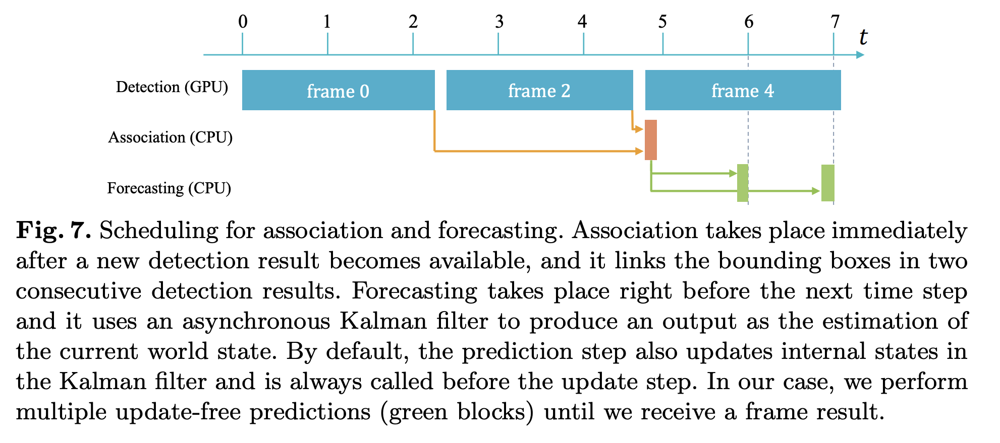

# sap-starterkit

This repo is the starter kit for the [Streaming Perception Challenge](https://eval.ai/web/challenges/challenge-page/800/overview) to be held as part of the Workshop on Autonomous Driving at CVPR 2021. It contains a benchmark toolkit for measuring algorithm's performance and several baseline methods to get you started.

As shown in the figure below, a streaming perception benchmark sends frames to the algorithm in real-time and queries for the state of the world at predefined time steps (determined by the framerate of the video). Therefore, unlike other benchmark toolkits (e.g., COCO toolkit) which run in a post-processing fashion, our toolkit is a daemon process that needs to be running before the algorithm starts processing. For more details about the the toolkit's design, check out the toolkit [README](https://github.com/karthiksharma98/sap-starterkit/blob/master/sap-toolkit/README.md).

## Getting started
  1. Follow the instructions [here](https://github.com/mtli/sAP/blob/master/doc/data_setup.md) to download and set up the dataset.
  2. Follow the instructions [here](doc/code_setup.md) to setup the required libraries.
  3.  Run the scripts:
       - First, run `start_toolkit.sh`. This will launch the benchmark toolkit daemon locally with a command-line interface (CLI). You can type `?` for help.
       -  Then, run either `start_det_baseline.sh` (for detection-only baseline) or `start_fs_baseline.sh` (for detection+forecasting baseline) as required. Once this has completed running, a `results.json` file will be generated in the output directory. If annotations are available (for e.g. validation set), you can type `evaluate results.json` in the evaluation server CLI to evaluate locally. For test set, evaluation can only be performed on the [challenge website](https://eval.ai/web/challenges/challenge-page/800/overview) by uploading the `results.json` file.

## Running the baselines

The baselines we provide show you how to use the API provided by our `sap_toolkit` package in your algorithm in order to communicate with the benchmark toolkit. You can take a look at the python code provided in `det_baseline.py` and `forecast_baseline.py` to see our implementations. There are also versions of these scripts (ending in `_perf.py`) that measure a few runtime metrics such as detection time, association time and forecasting time.

Further documentation on the `sap_toolkit` can be found [here].(https://github.com/karthiksharma98/sap-starterkit/tree/master/sap-toolkit)

## Upload your results to the challenge website

Once you have written your algorithm and generated your output using the toolkit, you can upload it to the [challenge website](https://eval.ai/web/challenges/challenge-page/800/overview).
   
## Baseline Methods Explained

### Detection-only track:

This method uses the Mask-RCNN (with ResNet-FPN-50 backbone) single-frame object detector with a relative input scale of 1.0 (it accepts Argoverse-HD images at their original 1920x1200 resolution). 

### Full-stack track:

This uses the same detector as above, however it incorporates a few techniques from the paper - dynamic scheduling, association and forecasting using a Kalman filter. This is explained in the figure below (taken from Fig. 7 from the paper).

## Advanced topics for development

**Simulation**: Simulation allows for efficient stagewise development (detection first and then tracking and forecasting) and also accuracy-priortized development (since the runtime can be simulated). This concept is explained in the [streaming perception paper](http://www.cs.cmu.edu/~mengtial/proj/streaming/) and its accompanying repo [sAP](https://github.com/mtli/sAP).

**Visualization**: Visualization helps to identify issues and provides intuitions for innovation. This is also included in the [sAP](https://github.com/mtli/sAP) repo.

